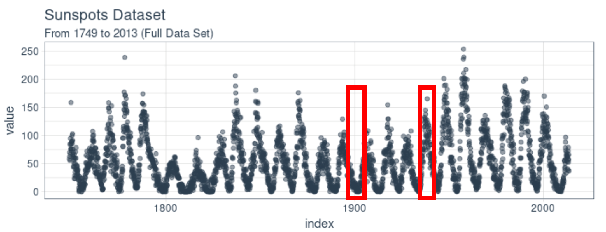

```{r setup, include=FALSE}
knitr::opts_chunk$set(echo = TRUE)
library(dplyr)
library(ggplot2)
library(tswge)
library(tseries)
library(zoo)
library(forecast)
library(nnfor)
```


<b>In Unit 13 we looked at an RNN model of the monthly sunspot data from 1745 to 2013 (sunspot.month in base R).  This model yielded an ASE of approximately 900 when forecasting a year in advance (12 months).  Your goal here will be to compare an ARMA or ARIMA model to the RNN model.<br><br>
1.	Stationarity:  Here we will check condition 3 of a stationary process.  Instead of looking at the first half versus the second half, let’s compare the timespans of fewer sunspots to the greater timespans of greater sunspots.  As an example, compare the acfs (autocorrelation structure) of the highlighted timespans below (you will need to approximate the start and end times).  Show your acfs and end with a statement of if you feel condition 3 is met or not.</b>


```{r sunspot.month}
# convert to data frame for plotting
sunspot = data.frame(as.data.frame(as.Date(as.yearmon(time(sunspot.month)))), sunspot.month)
names(sunspot) = c('Date', 'x')

# create first subset
sunspot1 = subset(sunspot, Date > as.Date('1894-05-01') & Date < as.Date('1905-07-01'))

# create second subset
sunspot2 = subset(sunspot, Date > as.Date('1934-05-01') & Date < as.Date('1944-07-01'))

# plot data w/ new subsets
ggplot(sunspot, aes(x = Date, y = x)) +
  geom_line() +
  scale_x_date(date_labels = '%Y') +
  geom_line(data = sunspot1, color = 'red') +
  geom_line(data = sunspot2, color = 'red')
```
It appears the subsets of the data are from June 1894 - June 1905 for the dip and June 1934 - June 1944. In order to determine if they satisfy condition three of stationarity, we need to look at their ACF.
```{r}
# create plotting vector
par(mfrow=c(1,2))

# acf for first subset
acf(sunspot1$x)

# acf for second subset
acf(sunspot2$x)
```
Based on the ACF, it appears the autocorrelation dampens as the lag increases. This is the case for both subsets! This is an indication that the values are dependent on how far they are in time, not when they are in time. As a result, this would indicate that condition three has been met.<br><br>
<b>
2.	In the blog we reviewed in class, the author used a comprehensive resampling scheme to generate many forecasts of 12 months in order to calculate the ASE.  We will not be this sophisticated or comprehensive but we will generate 3 ASEs and use the average of these ASEs to evaluate the ARMA or ARIMA model you fit.  To do this, separate the data into 3 mutually exclusive sets:  1751 to 1825, 1826 to 1900, and 1901 to 1975.</b>  <br><br>
In this case, I went ahead and looked at ARMA and ARIMA models to determine if the seasonality would have an impact on the models.
```{r}
# subset 1
sunspot1 = subset(sunspot, Date > as.Date('1750-12-01') & Date < as.Date('1826-01-01'))

plotts.sample.wge(sunspot1$x) #frequency = 0.007
```

```{r}
# remove the (1-B)^143 (seasonality)
s1 = artrans.wge(sunspot1$x, phi.tr = c(rep(0,142),1))
```

```{r, messages=FALSE, warnings=FALSE}
s1m1 = aic.wge(s1, p = 0:10, q = 0:10) # picks ARMA(10,5)
s1m2 = aic.wge(s1,p = 0:10, q = 0:10, type = "bic") # picks ARMA(3,4)

print('Non-stationary Model w/ Seasonality')
paste0('AIC Recommends: ARMA(',s1m1$p,',',s1m1$q,'); w/ Variance:',s1m1$vara)
paste0('BIC Recommends: ARMA(',s1m2$p,',',s1m2$q,'); w/ Variance:',s1m2$vara)

ss1m1 = aic.wge(sunspot1$x) # picks ARMA(3,2)
ss1m2 = aic.wge(sunspot1$x, type = "bic") # picks ARMA(3,2)

print('Stationary Model')
paste0('AIC Recommends: ARMA(',ss1m1$p,',',ss1m1$q,'); w/ Variance:',ss1m1$vara)
paste0('BIC Recommends: ARMA(',ss1m2$p,',',ss1m2$q,'); w/ Variance:',ss1m2$vara)
```
While the BIC is usually more conservative, it appears to have been outperformed in this instance by the ARMA(9,6) recommended by the AIC. As a result, we will continue moving forward with the ARMA(9,6) model. For the stationary model, both recommend an ARMA(3,2) model.
```{r}
# Store model estimation
# non stationary
print('Non-Stationary')
s1.est.y = est.arma.wge(s1, p = 10, q = 5)

#stationary
print('Stationary')
ss1.est.y = est.arma.wge(sunspot1$x, p = 3, q = 2)
```
Once the model is developed, we want to check the residuals to ensure the model has been fitted properly. We can check the residuals by looking at the ACF and the Ljung-Box Test to determine if the null hypothesis is rejected. The goal is to ensure the residuals look like white noise.
```{r}
# Non-stationary
# Verify residuals are white noise
acf(s1.est.y$res)

# Ljung-Box test, K = 24 (default)
ljung.wge(s1.est.y$res)$pval

#Ljung-Box test, K = 48
ljung.wge(s1.est.y$res, K = 48)$pval

# Stationary
# Verify residuals are white noise
acf(ss1.est.y$res)

# Ljung-Box test, K = 24 (default)
ljung.wge(ss1.est.y$res)$pval

#Ljung-Box test, K = 48
ljung.wge(ss1.est.y$res, K = 48)$pval
```
It appears residuals for both models are white noise and we fail to reject the hypothesis. We move on to forecasting.
```{r}
# ASE - Non-stationary
s1.fit = fore.aruma.wge(sunspot1$x, s = 143, phi = s1.est.y$phi, theta = s1.est.y$theta, n.ahead = 120, limits = FALSE, lastn = TRUE)

ASE1 = mean((sunspot1$x[781:900] - s1.fit$f)^2)
print('Sample 1 - Non-Stationary ASE:')
ASE1

# ASE - Stationary
ss1.fit = fore.aruma.wge(sunspot1$x, phi = ss1.est.y$phi, theta = ss1.est.y$theta, n.ahead = 120, limits = FALSE, lastn = TRUE)

ASE1s = mean((sunspot1$x[781:900] - ss1.fit$f)^2)
print('Sample 1 - Stationary ASE:')
ASE1s
```
In this case, it appears the ARIMA model outperformed the ARMA model substantially. The ARMA model is trying to model based on the sample mean while the ARIMA is looking at the last iterations and applying those. We now repeat the same steps for the other 2 samples.
```{r}
# subset 2
sunspot2 = subset(sunspot, Date > as.Date('1825-12-01') & Date < as.Date('1901-01-01'))

plotts.sample.wge(sunspot2$x) #frequency near 0; = 0.007
```

```{r}
# remove the (1-B)^143 (seasonality)
s2 = artrans.wge(sunspot2$x, phi.tr = c(rep(0,142),1))
```

```{r, messages=FALSE, warnings=FALSE}
s2m1 = aic.wge(s2, p = 0:10, q = 0:10) # picks ARMA(8,5)
s2m2 = aic.wge(s2,p = 0:10, q = 0:10, type = "bic") # picks ARMA(2,1)

print('Non-stationary w/ Seasonality:')
paste0('AIC Recommends: ARMA(',s2m1$p,',',s2m1$q,'); w/ Variance:',s2m1$vara)
paste0('BIC Recommends: ARMA(',s2m2$p,',',s2m2$q,'); w/ Variance:',s2m2$vara)

ss2m1 = aic.wge(sunspot2$x) # picks ARMA(2,1)
ss2m2 = aic.wge(sunspot2$x, type = "bic") # picks ARMA(2,1)

print('Stationary Model')
paste0('AIC Recommends: ARMA(',ss2m1$p,',',ss2m1$q,'); w/ Variance:',ss2m1$vara)
paste0('BIC Recommends: ARMA(',ss2m2$p,',',ss2m2$q,'); w/ Variance:',ss2m2$vara)
```

```{r}
# Store model estimation 
# Non-stationary
print('Non-Stationary')
s2.est.y = est.arma.wge(s2, p = 2, q = 1)

# Stationary
print('Stationary')
ss2.est.y = est.arma.wge(sunspot2$x, p = 2, q = 1)
```

```{r}
# Non-stationary
# Verify is residuals are white noise
acf(s2.est.y$res)

# Ljung-Box test, K = 24 (default)
ljung.wge(s2.est.y$res)$pval

#Ljung-Box test, K = 48
ljung.wge(s2.est.y$res, K = 48)$pval

# Stationary
# Verify is residuals are white noise
acf(ss2.est.y$res)

# Ljung-Box test, K = 24 (default)
ljung.wge(ss2.est.y$res)$pval

#Ljung-Box test, K = 48
ljung.wge(ss2.est.y$res, K = 48)$pval
```

```{r}
# ASE
s2.fit = fore.aruma.wge(sunspot2$x, s = 143, phi = s2.est.y$phi, theta = s2.est.y$theta, n.ahead = 120, limits = FALSE, lastn = TRUE)

ASE2 = mean((sunspot2$x[781:900] - s2.fit$f)^2)
print('Sample 2 - Non-Stationary ASE:')
ASE2

ss2.fit = fore.aruma.wge(sunspot2$x, phi = ss2.est.y$phi, theta = ss2.est.y$theta, n.ahead = 120, limits = FALSE, lastn = TRUE)

ASE2s = mean((sunspot2$x[781:900] - ss2.fit$f)^2)
print('Sample 2 - Stationary ASE:')
ASE2s
```

```{r}
# subset 3
sunspot3 = subset(sunspot, Date > as.Date('1900-12-01') & Date < as.Date('1976-01-01'))

plotts.sample.wge(sunspot3$x) #frequency near 0; = 0.007
```

```{r}
# remove the (1-B)^143 (seasonality)
s3 = artrans.wge(sunspot3$x, phi.tr = c(rep(0,142),1))
```

```{r, messages=FALSE, warnings=FALSE}
# Non-stationary
s3m1 = aic.wge(s3, p = 0:10, q = 0:10) # picks ARMA(9,8)
s3m2 = aic.wge(s3,p = 0:10, q = 0:10, type = "bic") # picks ARMA(1,2)

print('Non-stationary w/ Seasonality:')
paste0('AIC Recommends: ARMA(',s3m1$p,',',s3m1$q,'); w/ Variance:',s3m1$vara)
paste0('BIC Recommends: ARMA(',s3m2$p,',',s3m2$q,'); w/ Variance:',s3m2$vara)

# Stationary
ss3m1 = aic.wge(sunspot3$x, p = 0:10, q = 0:10) # picks ARMA(9,8)
ss3m2 = aic.wge(sunspot3$x,p = 0:10, q = 0:10, type = "bic") # picks ARMA(9,8)

print('Stationary:')
paste0('AIC Recommends: ARMA(',ss3m1$p,',',ss3m1$q,'); w/ Variance:',ss3m1$vara)
paste0('BIC Recommends: ARMA(',ss3m2$p,',',ss3m2$q,'); w/ Variance:',ss3m2$vara)
```

```{r}
# Store model estimation
print('Non-Stationary')
s3.est.y = est.arma.wge(s3, p = 9, q = 8)

print('Stationary')
ss3.est.y = est.arma.wge(sunspot3$x, p = 9, q = 8)
```

```{r}
# Non-stationary
# Verify residuals are white noise
acf(s3.est.y$res)

# Ljung-Box test, K = 24 (default)
ljung.wge(s3.est.y$res)$pval

#Ljung-Box test, K = 48
ljung.wge(s3.est.y$res, K = 48)$pval

# Stationary
# Verify is residuals are white noise
acf(ss3.est.y$res)

# Ljung-Box test, K = 24 (default)
ljung.wge(ss3.est.y$res)$pval

#Ljung-Box test, K = 48
ljung.wge(ss3.est.y$res, K = 48)$pval
```

```{r}
# ASE
# Non-stationary
s3.fit = fore.aruma.wge(sunspot3$x, s = 143, phi = s3.est.y$phi, theta = s3.est.y$theta, n.ahead = 120, limits = FALSE, lastn = TRUE)

ASE3 = mean((sunspot3$x[781:900] - s3.fit$f)^2)
print('Sample 3 - Non-stationary ASE:')
ASE3

# Stationary
ss3.fit = fore.aruma.wge(sunspot3$x, phi = ss3.est.y$phi, theta = ss3.est.y$theta, n.ahead = 120, limits = FALSE, lastn = TRUE)

ASE3s = mean((sunspot3$x[781:900] - ss3.fit$f)^2)
print('Sample 3 - Stationary ASE:')
ASE3s
```

```{r}
print('Average ASE for Non-stationary Models')
(ASE1 + ASE2 + ASE3)/3
print('Average ASE for Stationary Models')
(ASE1s + ASE2s + ASE3s)/3
```
Comparing both stationary and non-stationary models, we found the stationary models performed better than the stationary models. They were more useful in predicting the values moving forward and have lower ASE values. While it appeared (visually) that the non-stationary models were better at predicting the values, the fact that they were repeating the last iteration was penalizaing them.<br><br>
Looking at the complete data, it appears there are high peaks and low peaks. However, the non-stationary assumes these are following some cycle, while the stationary model fails to account for them. This allows the stationary model to use the sample mean in order to produce values moving forward instead of the last iteration, such as the non-stationary model.<br><br>
<b>
3.	Based on your findings and your intuition, fit a stationary or non-stationary model to each partition and use it to forecast the last 12 months of that partition (you may refit the model for each partition or use the same model… your choice).  Calculate and report the ASE of each forecast and compare it to the ASE from the RNN model. Also, fully specify your model(s) in backshift notation.</b>
```{r}
# model 1
# ARMA(3,2)
s1.fit12 = fore.arma.wge(sunspot1$x, phi = ss1.est.y$phi, theta = ss1.est.y$theta, n.ahead = 12, limits = FALSE, lastn = TRUE)

# ASE
print('ASE for ARMA(3,2)')
mean((sunspot1$x[889:900] - s1.fit12$f)^2)

# RNN
rnns1 = ts(sunspot1$x[1:888])
rnns1.fit = mlp(rnns1)
f1 = forecast(rnns1.fit, h = 12)

# ASE
print('ASE for RNN')
mean((sunspot1$x[889:900]-f1$mean)^2)

# Plot
plot(sunspot1$x[889:900],type = "l")
lines(seq(1,12),f1$mean, col = "blue")
lines(seq(1,12), s1.fit12$f, col = 'red')
```

```{r}
# model 2
# ARMA(2,1)
s2.fit12 = fore.arma.wge(sunspot2$x, phi = ss2.est.y$phi, theta = ss2.est.y$theta, n.ahead = 12, limits = FALSE, lastn = TRUE)

# ASE
print('ASE for ARMA(2,1)')
mean((sunspot2$x[781:900] - s2.fit12$f)^2)

# RNN
rnns2 = ts(sunspot2$x[1:888])
rnns2.fit = mlp(rnns2)
f2 = forecast(rnns2.fit, h = 12)

#ASE
print('ASE for RNN')
mean((sunspot2$x[889:900]-f2$mean)^2)

# Plot
plot(sunspot2$x[889:900],type = "l")
lines(seq(1,12),f2$mean, col = "blue")
lines(seq(1,12), s2.fit12$f, col = 'red')
```

```{r}
# model 3
# ARMA(9,8)
s3.fit12 = fore.arma.wge(sunspot3$x, phi = ss3.est.y$phi, theta = ss3.est.y$theta, n.ahead = 12, limits = FALSE, lastn = TRUE)

# ASE
mean((sunspot3$x[781:900] - s3.fit12$f)^2)

# RNN
rnns3 = ts(sunspot3$x[1:888])
rnns3.fit = mlp(rnns3)
f3 = forecast(rnns3.fit, h = 12)

#ASE
mean((sunspot3$x[889:900]-f3$mean)^2)

# Plot
plot(sunspot3$x[889:900],type = "l")
lines(seq(1,12),f3$mean, col = "blue")
lines(seq(1,12), s3.fit12$f, col = 'red')
```
<b>
4.	Clearly describe why you chose the stationary or non-stationary model you chose above.</b><br><br>

I decided to go with a stationary model because the evidence failed to violate any of the conditions for stationarity. In addition, the factor tables all have a unit root, which would support stationarity. Furthermore, the stationary models all performed better than the non-stationary models with respect to the ASE over the last 10 years worth of data in the samples.<br><br>
However, that was not sufficient to outperform the RNN model, which simply crushed the stationary model. Overall, the RNN performed better but the stationary model still proved to be useful.

<i>The document to turn in here will be a knit pdf or html of an RMD (with the code visible.)  Try and keep your output to a reasonable length but do provide useful comments (as usual) to your code and written explanations where appropriate.  Be clear but terse.  Part of the grade is on your results and part of your grade is how clear and efficient you are able to communicate your analysis.  To be ultra-secure, please submit this to 2DS and email it to me as well.   
<br><br>
Great job this semester! I will see you at immersion and / or at graduation!
Whamo!</i>
